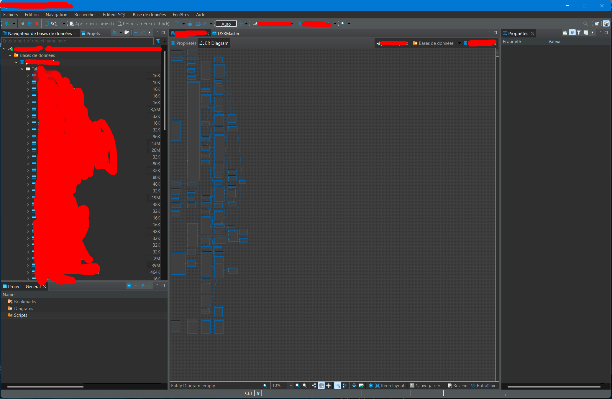
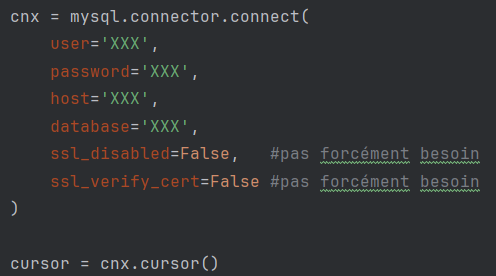
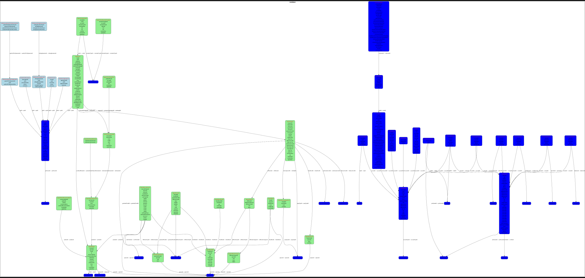
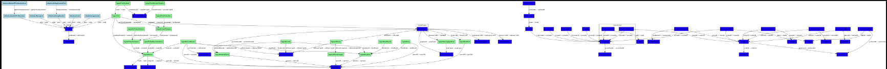
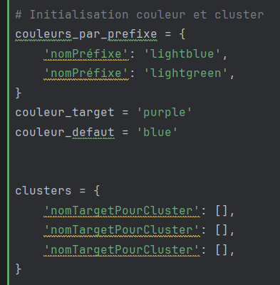
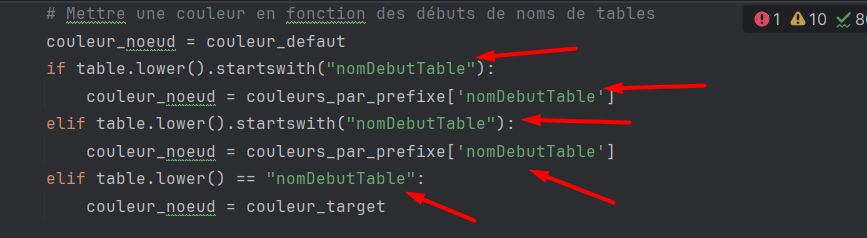
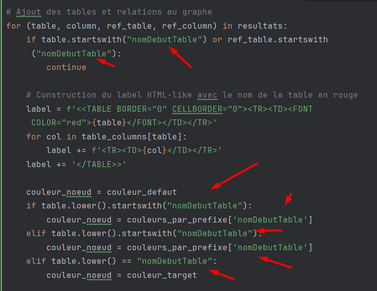

## Pourquoi ce projet (le problème)

L'objectif de ce code est de créer une visualisation de notre base de données (pas de ses valeurs mais de ses tables et de ses champs) pour comprendre rapidement notre base de données (bdd). J'ai essayé de chercher des outils, mais il n'y avait pas de quoi pour représenter la table en elle-même (il y en a par contre beaucoup pour traiter, afficher, travailler avec les données de la bdd).

Pour une bdd assez petite, on peut encore se débrouiller mais le problème c'est quand on a des bdd très grandes avec trop de tables, on ne sait plus où regarder.

Une façon non-code est faite avec le logiciel DBeaver (très bien fait d'ailleurs, je recommande quand on doit travailler sur des bdd SQL et NoSQL [MongoDB principalement]), en plus c'est open-source.
Dbeaver : 
- leur site -> https://dbeaver.io/
- le git hub -> https://github.com/dbeaver/dbeaver?tab=readme-ov-file

Sur DBeaver, j'ai pu représenter ma table visuellement de cette façon :

En zoomant, c'était horrible. Bien mais pas idéal. Mes recherches m'ont permis de comprendre qu'on pouvait modifier les données affichées sur DBeaver mais pas le positionnement des éléments et les attributs de notre vue.

----
J'ai donc cherché une manière de pouvoir représenter la bdd, tout en automatisant le processus : je ne voulais pas utiliser des sites comme :
- https://dbdiagram.io/home (avec du code)
- https://www.drawio.com/ (à la main)
pour tout faire à la main. 

J'ai besoin d'une solution que je peux rafraîchir dans le futur et que le schéma puisse se mettre à jour tout seul avec les modifications de la bdd.
## Ce que j'ai trouvé 
C'est bien une des rares solutions que j'ai trouvée : faire un script.

Il y a deux éléments dans le script de le processus :

#### 1. Importer les données dans mon Python pour pouvoir travailler avec. Pour ca j'ai utilisé mysql-connector-python :

- le site dans pypi.org : https://pypi.org/project/mysql-connector-python/
- dans la documentation de mySQL : https://dev.mysql.com/doc/connector-python/en/connector-python-example-connecting.html (a savoir que 
Je me suis connecté sur une bdd MariaDB mais c'est très bien expliqué ici et facilement configurable sur d'autres bdd)

Grâce à mysql-connector-python, j'ai pu importer ma BDD dans mon fichier Python :

#### 2. Une fois que c'est fait j'ai utilisé la bibliothèque pygraphviz 
- le site dans pypi.org : https://pypi.org/project/pygraphviz/
- sa documentation : https://pygraphviz.github.io/documentation/stable/
cette librairie est utile pour créer des graphes (ici à partir de mes tables de BDD)

## Le rendu

J'ai fait deux schémas car l'un n'était pas très lisible avec tous les noms des champs des tables. Évidemment, sur mon ordinateur en local, je peux zoomer et ce n'est pas flou (il y a même la possibilité d'exporter son schéma en SVG si vous préférez, mais ça change quelques paramètres) :

Sans le nom des tables :

Mais j'ai gardé les deux, je trouve ça pratique.

## En détail ce que vous devez changer pour que ca marche

Pour utiliser le code fourni afin de générer un diagramme de votre base de données avec ou sans les noms des champs pour chaque table, voici les étapes essentielles à suivre, résumées de manière concise :

Merci ChatGPT pour ça 😂 ->

1. Établissement de la connexion à la base de données :
- Utilisez les informations de connexion telles que le nom d'utilisateur, le mot de passe, l'hôte et le nom de la base de données pour établir une connexion à la base de données MySQL.

2. Initialisation des couleurs et des clusters :
- Assurez-vous que les dictionnaires couleurs_par_prefixe et clusters contiennent les valeurs correctes.

3. Création du graphe :
- Supprimez la ligne G.graph_attr.update(rankdir='TB', nodesep='0.5', ranksep='1', size="110,12!"), car elle peut ne pas être nécessaire.
4. Ajout des nœuds et des arêtes au graphe :
- Dans la boucle for, assurez-vous que les noms de tables et de colonnes sont correctement récupérés à partir des résultats de la requête SQL.

5. Ajout des tables aux clusters spécifiés :
- Assurez-vous que les tables sont ajoutées aux clusters appropriés.
6. Configuration finale et sauvegarde du schéma :
- Vérifiez que le nom du fichier de sortie pour le schéma est correct.
7. Fermeture de la connexion à la base de données :
- Assurez-vous que la connexion à la base de données est correctement fermée à la fin.

Ce qui est cool, c'est que vous pouvez le modifier à votre façon, très simplement et qu'automatiquement les noms des tables sont sélectionnés avec la requête SQL. On a un vrai script qu'on peut lancer à tout moment pour voir notre BDD avec les vraies valeurs sans avoir besoin de tout faire à la main.