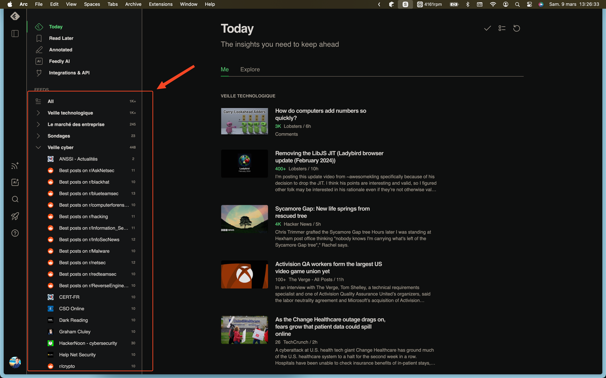
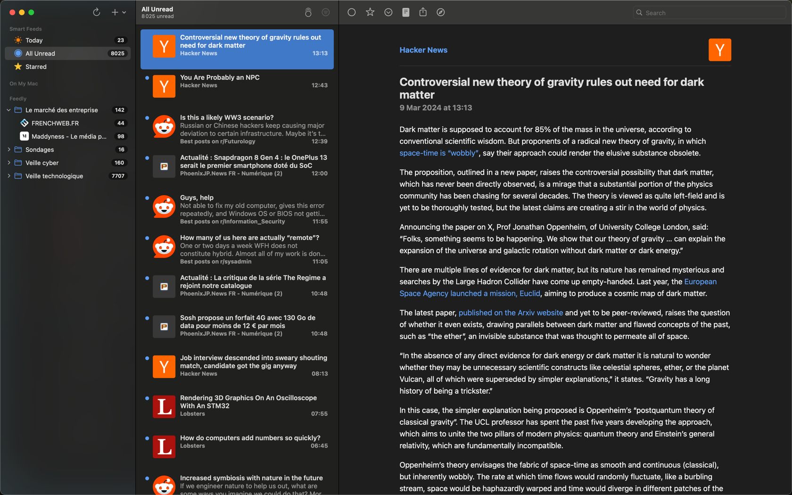

# Ma veille cyber

Cette veille cyber comprend une veille technologique, une veille du marché des entreprises
avec également des sondages et, bien sûr, une veille spécifique à la cyber.

### Sommaire 
[Ma veille technologique](#ma-veille-technologique-)
 
[Ma veille des marchés d’entreprises](#ma-veille-des-marchés-dentreprises)
 
[Ma veille cyber](#ma-veille-cyber-)
 
[Comment faire une veille -  version rapide](#comment-faire-une-veille)

## Ma veille technologique 

### Science technologies général :

 

Le site : <a href="https://techcrunch.com/" >techcrunch</a>

 

Le site : <a href="https://www.theverge.com/" >Le site de The Verge</a>

 

Le site : <a href="https://www.zdnet.fr/" >ZDNET </a>

 

Le site : <a href="https://venturebeat.com/" >Venture Beat </a>

 

Le site : <a href="https://www.technologyreview.com/" >MIT technology  Review </a>

 

Le site : <a href="https://www.usine-digitale.fr/" >l'usine digitale</a>

 

Le site : <a href="https://www.lesechos.fr/tech-medias" >Les échos tech-medias</a>

 

Le site : <a href="https://knightcolumbia.org/" >Knight First Amendment Institute at Columbia University</a>

 

Le site : <a href="https://slashdot.org/" >slashdot</a>

 

Le site : <a href="https://www.vox.com/technology" >Vox technology</a>

 

Le site : <a href="https://www.geekwire.com/" >Geekwire</a>

### Sites communautaires :

 

Le site : <a href="https://lobste.rs/" >Lobste</a>

 

Le site : <a href="https://news.ycombinator.com/" >Hacker News</a>

 

Le site : <a href="https://www.journalduhacker.net/" >Le journal du hacker</a>

 

Le site : <a href="http://phoenixjp.net/news/" >Phoenixjp</a>

 

Les newsletters : <a href="https://tldr.tech/newsletters" >TLDR newsletters</a>

Vraiment super, plusieurs thématiques, prenez ceux qui vous conviennent le plus. Moi, newsletter classique et InfoSec. 
Il y a aussi une bonne newsletter IA, que je n'ai pas mise dans ma veille car après ca fait 
beaucoup beaucoup trop d'articles à lire chaques jours.

Les newsletters : <a href="https://daily.dev/" >Daily.dev</a>

Chaqu'une de vos lectures sont comptabilisés. Ce qui vous permet de sortir une carte daily.dev en a. La mienne par exemple d'aujourd'hui (pour les CV) :

Hyper intéressant, filtres et barre de recherche très pertinentes. Les articles hot, ou les mieux notés sont en haut.

### Blogs :

 

Le blog de : <a href="https://korben.info/" >Korben</a>

 

Le blog de : <a href="https://www.devoreur2code.com/fr" >Fabien Schlegel</a>

### Reddit :

 

Le reddit de : <a href="https://www.reddit.com/r/programming/" >r/programming</a>

 

Le reddit de : <a href="https://www.reddit.com/r/technology/" >r/technology</a>

 

Le reddit de : <a href="https://www.reddit.com/r/AskComputerScience/" >r/AskComputerScience</a>

 

Le reddit de : <a href="https://www.reddit.com/r/Futurology/" >r/Futurology</a>

 

Le reddit de : <a href="https://www.reddit.com/r/learnprogramming/" >r/learnprogramming</a>

 

Le reddit de : <a href="https://www.reddit.com/r/sysadmin/" >r/sysadmin</a>

### Petite veille IA

 

Le reddit de : <a href="https://www.thedeepview.co/" >The Deep View</a>

## Ma veille des marchés d’entreprises

 

Le site de : <a href="https://www.maddyness.com/" >Maddyness</a>

 

Le site de : <a href="https://www.frenchweb.fr/" >Frenchweb</a>

### Sondages

 

Le site de : <a href="https://csa.eu/news/" >Consurmer science & Analytics</a>

 

Le site de : <a href="https://fr.yougov.com/" >YouGov</a>

 

Le site de : <a href="https://www.ifop.com/" >Ifop</a>

 

Le site de : <a href="https://www.institut-viavoice.com/" >Institut Viavoice</a>

 

Le site de : <a href="https://www.opinion-way.com/fr/" >Opinions way </a>

## Ma veille cyber 

 

Le site de : <a href="https://hackernoon.com/tagged/cybersecurity" >Hackernoon </a>

 

Le site de : <a href="https://thehackernews.com/" >The hacker News </a>

 

Le site de : <a href="https://www.undernews.fr/" >Undernews </a>

 

Le site de : <a href="https://www.zataz.com/" >Zataz </a>

 

Le site de : <a href="https://www.csoonline.com/" >CSO </a>

 

Le site de : <a href="https://veillecyberland.wordpress.com/" >Veilllecyberland </a>

 

Le site de : <a href="https://www.darkreading.com/" >Darkreading </a>

 

Le site de : <a href="https://www.helpnetsecurity.com/" >Help net security </a>

 

Le site de : <a href="https://www.securityweek.com/" >Security Week </a>

### Blog : 

 

Le blog de : <a href="https://grahamcluley.com/" >Graham Cluley </a>

### Gouvernements / organisations /organismes :

 

Le site de : <a href="https://www.cert.ssi.gouv.fr/" >du Centre gouvernemental de veille, d’alerte et de réponse aux attaques informatiques (CERT-FR)  </a>

 

Les publications de : <a href="https://cyber.gouv.fr/publications" >l'ANSSI </a>

### Reddit :

 

Le reddit de : <a href="https://www.reddit.com/r/netsec/" >r/netsec</a>

 

Le reddit de : <a href="https://www.reddit.com/r/InfoSecNews/" >r/InfoSecNews</a>

 

Le reddit de : <a href="https://www.reddit.com/r/AskNetsec/">r/AskNetsec</a>

 

Le reddit de : <a href="https://www.reddit.com/r/blackhat/" >r/blackhat</a>

 

Le reddit de : <a href="https://www.reddit.com/r/blueteamsec/" >r/blueteamsec</a>

 

Le reddit de : <a href="https://www.reddit.com/r/computerforensics/" >r/computerforensics</a>

 

Le reddit de : <a href="https://www.reddit.com/r/crypto/" >r/crypto</a>

 

Le reddit de : <a href="https://www.reddit.com/r/hacking/" >r/hacking</a>

 

Le reddit de : <a href="https://www.reddit.com/r/Information_Security/" >r/Information_Security</a>

 

Le reddit de : <a href="https://www.reddit.com/r/Malware/" >r/Malware</a>

 

Le reddit de : <a href="https://www.reddit.com/r/ReverseEngineering/" >r/ReverseEngineering</a>

 

Le reddit de : <a href="https://www.reddit.com/r/redteamsec/" >r/redteamsec</a>

### Sur X : 

 

Le reddit de : <a href="https://twitter.com/maddiestone" >@maddiestone</a>

 

Le reddit de : <a href="https://twitter.com/cglyer">@cglyer </a>

 

Le reddit de : <a href="https://twitter.com/TCMSecurity" >@TCMSecurity</a>

 

Le reddit de : <a href="https://twitter.com/PentesterLab" >@PentesterLab</a>

 

Le reddit de : <a href="https://twitter.com/emollick" >@emollick</a>

 

Le reddit de : <a href="https://twitter.com/NahamSec" >@NahamSec</a>

 

Le reddit de : <a href="https://twitter.com/ippsec" >@ippsec</a>

 

Le reddit de : <a href="https://twitter.com/TheCyberSecHub" >@TheCyberSecHub</a>

 

Le reddit de : <a href="https://twitter.com/binitamshah" >@binitamshah</a>

 

Le reddit de : <a href="https://twitter.com/schneierblog" >@schneierblog</a>

 

Le reddit de : <a href="https://twitter.com/gcluley" >@gcluley</a>

 

Le reddit de : <a href="https://twitter.com/Jhaddix" >@Jhaddix</a>

## Comment faire une veille

J'utilise :

Feedly (https://feedly.com/) pour regrouper tout mon feed :

Et je relie Feedly à l'application NetNewsWire (https://netnewswire.com/ - malheureusement pas disponible uniquement sur Mac - sur Windows/Linux, on peut lire sur Feedly ou rechercher une autre solution de lecture). J'aime bien la simplicité de l'application qui me permet de lire rapidement, bien plus vite que sur Feedly ou encore Readwise Reader (https://readwise.io/read), qui est très bien aussi, je recommande.

Mon Flux de travail avec NetNewsWire :

Ce n'est pas grave de ne pas tout lire. L'important, c'est de noter ce qu'on trouve d'intéressant, pour s'organiser et organiser une session dans la semaine pour tester ce qu'on a repéré dans notre veille (nouvel outil, process, manière de coder, formation, vidéo, ...).